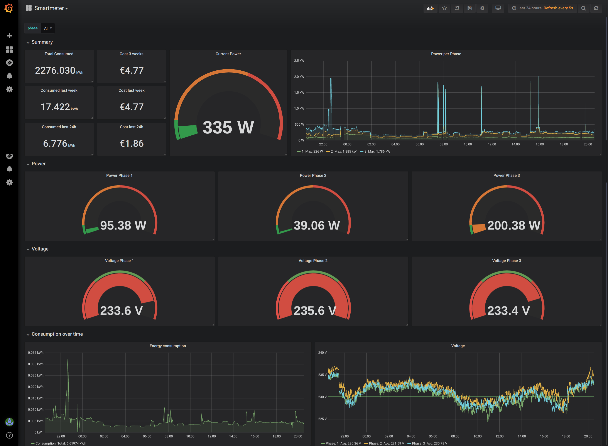
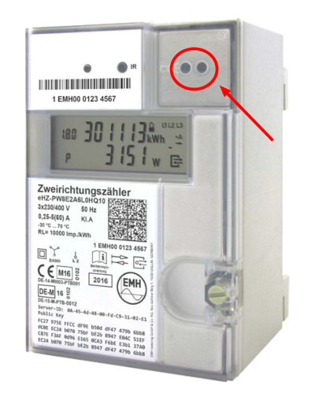
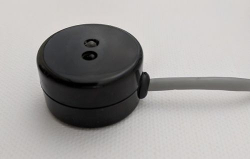
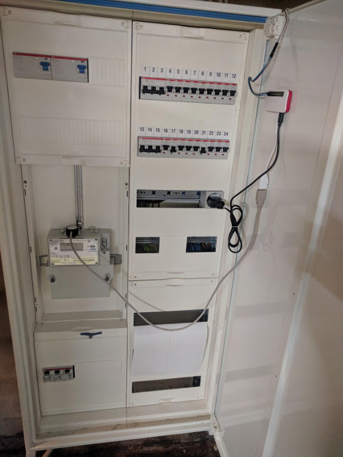

# Smartmeter
Monitor an electricity smart meter (OBIS) with prometheus and persist to a databse



## Setup
### What you need
- A digital electricity meter with data interface

- A IR reader with USB ([ebay example device](https://www.ebay.de/itm/USB-IR-Infrarot-Lese-Schreibkopf-fuer-Stromzaehler-Smart-Meter-/273204540009))

- A Raspberry Pi (I use a Zero W in my setup)
- Another Raspberry pi or other server able to run Grafana and Prometheus

### Final setup


## Run app

#### Compile

```bash
# for your current machine
$ go build -o smartmeter

# for Raspberry Pi zero w 
$ env GOOS=linux GOARCH=arm GOARM=6 go build -o smartmeter
``` 

#### Run

```bash
Usage of ./smartmeter:
      --db-flush duration    Flush after duration (default 1m0s)
      --db-host string       Db host (default "localhost")
      --db-name string       Db name (default "root")
      --db-password string   Db password (default "root")
      --db-port string       Db port (default "5432")
      --db-user string       Db user (default "postgres")
      --persist string       type of persistence: [none, postgres] (default "none")
      --reader-port string   Device name of reader (default "/dev/ttyUSB0")
```